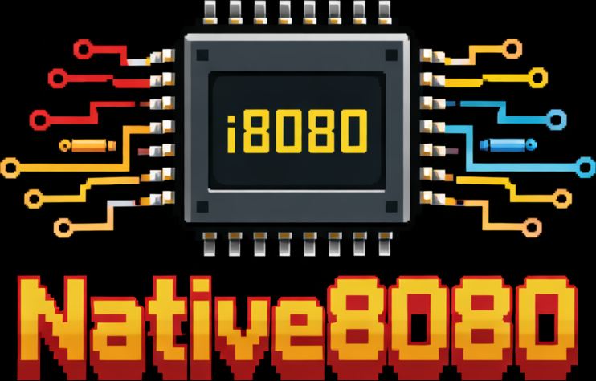

<div align="center">
  <picture>
    <source media="(prefers-color-scheme: light)" srcset=".github/images/logo.png">
    <source media="(prefers-color-scheme: dark)" srcset=".github/images/logo.png">
    
  </picture>
</div>

<div align="center">
  <h3>A modular Intel 8080 CPU emulator written in modern C++20, with basic CP/M BDOS support.</h3>
</div>

## Features

- Full 8080 instruction set — all documented opcodes including `DAA`, rotate group, and the complete conditional branch/call/return matrix
- Accurate flag logic — Sign, Zero, Parity, Carry and Auxiliary Carry updated per instruction per the Intel 8080 datasheet
- 64 KB address space backed by `std::array<uint8_t, 0x10000>`
- Pluggable I/O bus — wire `IN`/`OUT` ports to any peripheral via `std::function` callbacks
- CP/M BDOS hook — supports function 2 (character output) and function 9 (string output), enough to run standard `.COM` programs
- Returns clock-cycle counts from `Step8080` for future timing/throttling

## Repository layout

```
Native8080/
├── src/
│   ├── cpu8080.h       # State8080 struct, IOBus, public API
│   ├── cpu8080.cpp     # Fetch-Decode-Execute engine
│   └── main.cpp        # CP/M loader and main loop
├── samples/
│   └── hello.com       # Pre-built CP/M Hello World (generated)
├── docs/
│   └── instruction_set_8080.txt  # Opcode reference used during development
├── CMakeLists.txt
└── LICENSE
```

## Building

**Requirements:** CMake ≥ 3.16, a C++20-capable compiler (GCC 10+, Clang 12+).

```bash
cmake -S . -B build -DCMAKE_BUILD_TYPE=Release
cmake --build build
```

The binary is placed at `build/native8080`.

A `Debug` build automatically enables `-fsanitize=address,undefined` when the
compiler supports it:

```bash
cmake -S . -B build -DCMAKE_BUILD_TYPE=Debug
cmake --build build
```

## Running

```bash
# Standard CP/M .COM program (loaded at 0x0100)
./build/native8080 samples/hello.com

# ROM image loaded at a custom address (hex)
./build/native8080 rom.bin 0000
```

The emulator prints diagnostic messages to `stderr` and program output to
`stdout`, so they can be separated:

```bash
./build/native8080 samples/hello.com 2>/dev/null
```

## CP/M compatibility

The emulator installs a minimal BDOS shim:

| C register | Function | Behaviour |
|:---:|---|---|
| 2 | Console character output | Prints the character in `E` |
| 9 | Print string | Prints from `[DE]` until `$` |

A `RET` is placed at `0x0005` and a `HLT` at `0x0000`, so programs that jump
to the warm-boot vector exit cleanly.

## Extending I/O

Edit `make_io_bus()` in [src/main.cpp](src/main.cpp) to attach real devices:

```cpp
io.out_handler = [](uint8_t port, uint8_t val) {
    if (port == 0x01) my_uart_write(val);
};
io.in_handler = [](uint8_t port) -> uint8_t {
    if (port == 0x01) return my_uart_read();
    return 0xFF;
};
```

## License

See [LICENSE](LICENSE).
